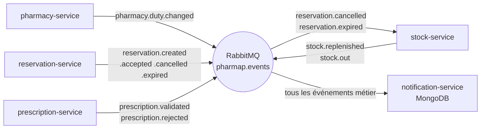

# Événements asynchrones (RabbitMQ)

```mermaid
flowchart LR
  PHs[pharmacy-service] -->|pharmacy.duty.changed| MQ((RabbitMQ<br/>pharmap.events))
  STs[stock-service] -->|stock.replenished<br/>stock.out| MQ
  RSs[reservation-service] -->|reservation.created<br/>.accepted .cancelled .expired| MQ
  PRs[prescription-service] -->|prescription.validated<br/>prescription.rejected| MQ
  MQ -->|reservation.cancelled<br/>reservation.expired| STs
  MQ -->|tous les événements métier| NTs[notification-service<br/>MongoDB]
```

> Diagramme Mermaid : affiché automatiquement par GitHub. Pour l'exporter en image : https://mermaid.live
