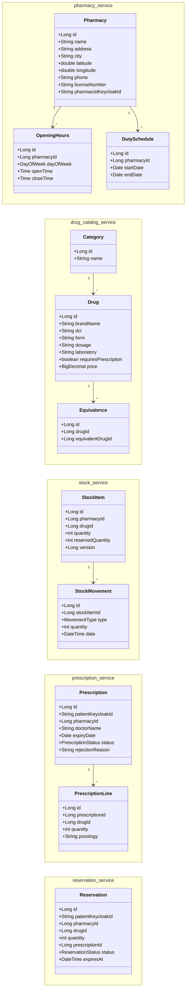

# Modèle de données par service

```mermaid
classDiagram
  direction LR
  namespace pharmacy_service {
    class Pharmacy {
      +Long id
      +String name
      +String address
      +String city
      +double latitude
      +double longitude
      +String phone
      +String licenseNumber
      +String pharmacistKeycloakId
    }
    class OpeningHours {
      +Long id
      +Long pharmacyId
      +DayOfWeek dayOfWeek
      +Time openTime
      +Time closeTime
    }
    class DutySchedule {
      +Long id
      +Long pharmacyId
      +Date startDate
      +Date endDate
    }
  }
  namespace drug_catalog_service {
    class Drug {
      +Long id
      +String brandName
      +String dci
      +String form
      +String dosage
      +String laboratory
      +boolean requiresPrescription
      +BigDecimal price
    }
    class Category {
      +Long id
      +String name
    }
    class Equivalence {
      +Long id
      +Long drugId
      +Long equivalentDrugId
    }
  }
  namespace stock_service {
    class StockItem {
      +Long id
      +Long pharmacyId
      +Long drugId
      +int quantity
      +int reservedQuantity
      +Long version
    }
    class StockMovement {
      +Long id
      +Long stockItemId
      +MovementType type
      +int quantity
      +DateTime date
    }
  }
  namespace prescription_service {
    class Prescription {
      +Long id
      +String patientKeycloakId
      +Long pharmacyId
      +String doctorName
      +Date expiryDate
      +PrescriptionStatus status
      +String rejectionReason
    }
    class PrescriptionLine {
      +Long id
      +Long prescriptionId
      +Long drugId
      +int quantity
      +String posology
    }
  }
  namespace reservation_service {
    class Reservation {
      +Long id
      +String patientKeycloakId
      +Long pharmacyId
      +Long drugId
      +int quantity
      +Long prescriptionId
      +ReservationStatus status
      +DateTime expiresAt
    }
  }
  Pharmacy "1" --> "*" OpeningHours
  Pharmacy "1" --> "*" DutySchedule
  Category "1" --> "*" Drug
  Drug "1" --> "*" Equivalence
  StockItem "1" --> "*" StockMovement
  Prescription "1" --> "*" PrescriptionLine
```

> Diagramme Mermaid : affiché automatiquement par GitHub. Pour l'exporter en image : https://mermaid.live
